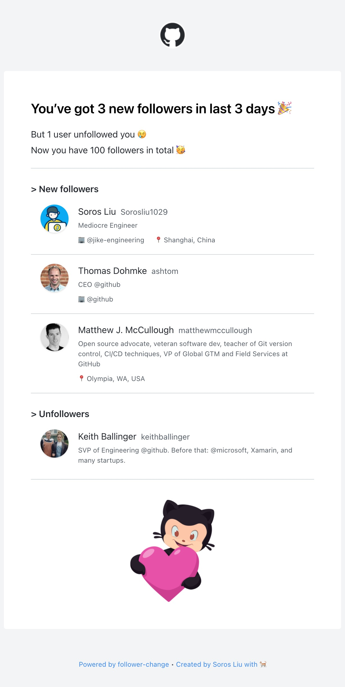

# Follower Change

### What this action does ?

Get GitHub follower change event, i.e. when a user follows or unfollows you.

It is **not** realtime, since GitHub does not provide 'follow' events.

So you may run it periodically as a cron job.

Refer to [detailed explanation](#how-it-works-) for how it works.

### [My own working example:](https://github.com/Sorosliu1029/Sorosliu1029/blob/master/.github/workflows/follower-notifier.yml)

```yaml
name: follower notifier
on:
  # notify me daily
  schedule:
    - cron: '0 3 * * *' # in UTC time
jobs:
  main:
    runs-on: ubuntu-latest
    steps:
      - name: get follower change
        id: followerChange
        uses: Sorosliu1029/follower-change@v2
        with:
          myToken: ${{ secrets.MY_TOKEN }}
          notifyUnFollowEvent: true
      - name: email me
        uses: dawidd6/action-send-mail@v3
        if: steps.followerChange.outputs.shouldNotify == 'true'
        with:
          server_address: smtp.qq.com
          server_port: 465
          username: ${{ secrets.MAIL_USERNAME }}
          password: ${{ secrets.MAIL_PASSWORD }}
          subject: GitHub Follower Change
          from: Follower Change Notifier
          to: ${{ secrets.TO_EMAIL_ADDRESS }}
          # use html file from previous step as email body
          html_body: file://${{ steps.followerChange.outputs.htmlFilePath }}
```
### Input and output of this action

- input:
  - `myToken`: [GitHub personal access token](https://github.com/settings/tokens/new) with at least **'read:user' and 'repo'** scope. _⚠️ You should store this token as [secret](#secrets)._ This input is required.
  - `notifyUnFollowEvent`: should notify unfollow event or not. This input is optional, default is `false`.
- output:
  - `changed`: bool, whether follower changed or not.
  - `shouldNotify`: bool, should trigger following steps. Skip notification when no change or first run.
  - `htmlFilePath`: string, path of html file for follower change info
  - `markdown`: string, markdown for follower change info
  - `plainText`: string, plain text for follower change info

### Secrets

The only required secret is `MY_TOKEN`, which is used as input `myToken` for this action.

You should store your secret at `https://github.com/{YOUR_NAME}/{YOUR_REPO}/settings/secrets/actions`, refer to [creating encrypted secrets for a repository](https://docs.github.com/en/actions/security-guides/encrypted-secrets#creating-encrypted-secrets-for-a-repository) for more details.

For step 'email me', You could refer to [Send mail Github Action](https://github.com/dawidd6/action-send-mail)

### How it works ?

- Use GitHub GraphQL API to get all current followers
- Download previous snapshotted followers from GitHub Action artifact
- Compare current followers with previous followers to get follow and unfollow events
- Upload current followers as new snapshot to GitHub Action artifact

### HTML output

HTML is generated by [follower-change-email](https://github.com/Sorosliu1029/follower-change-email)


